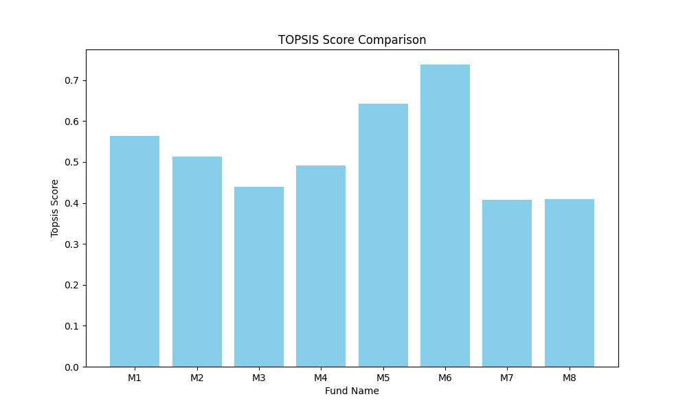

# Assignment - Topsis

**Topsis** (Technique for Order of Preference by Similarity to Ideal Solution) is a multi-criteria decision analysis method that compares a set of alternatives based on a set of criteria.

---

## Methodology

The TOPSIS method is calculated in the following steps:

1.  **Vector Normalization**:
    The decision matrix is normalized using vector normalization:
    $$r_{ij} = \frac{x_{ij}}{\sqrt{\sum_{i=1}^{m} x_{ij}^2}}$$

2.  **Weighted Normalized Decision Matrix**:
    The normalized matrix is multiplied by the associated weights:
    $$v_{ij} = w_j * r_{ij}$$

3.  **Ideal Best and Ideal Worst Solutions**:
    Identify the ideal best ($V^+$) and ideal worst ($V^-$) values for each criterion.
    - For beneficial attributes (impact '+'), $V^+$ is the max and $V^-$ is the min.
    - For non-beneficial attributes (impact '-'), $V^+$ is the min and $V^-$ is the max.

4.  **Separation Measures (Euclidean Distance)**:
    Calculate the distance of each alternative from the ideal best and ideal worst:
    $$S_i^+ = \sqrt{\sum (v_{ij} - V_j^+)^2}$$
    $$S_i^- = \sqrt{\sum (v_{ij} - V_j^-)^2}$$

5.  **Performance Score**:
    Calculate the relative closeness to the ideal solution:
    $$P_i = \frac{S_i^-}{S_i^+ + S_i^-}$$

6.  **Ranking**:
    Rank alternatives based on their performance score $P_i$ in descending order.

---

## Result Table

Running the Topsis algorithm on `data.xlsx` with equal weights (1,1,1,1,1) and positive impacts (+,+,+,+,+) produced the following top results:

| Fund Name | Topsis Score | Rank |
| :--- | :--- | :--- |
| M6 | 0.7381 | 1 |
| M5 | 0.6419 | 2 |
| M1 | 0.5637 | 3 |
| M2 | 0.5130 | 4 |
| M4 | 0.4920 | 5 |
| M3 | 0.4392 | 6 |
| M8 | 0.4085 | 7 |
| M7 | 0.4074 | 8 |

---

## Result Graph

The following bar chart compares the Topsis Score of different funds:



---

## Usage (CLI)

```bash
python topsis.py data.xlsx "1,1,1,1,1" "+,+,+,+,+" result.csv
```
